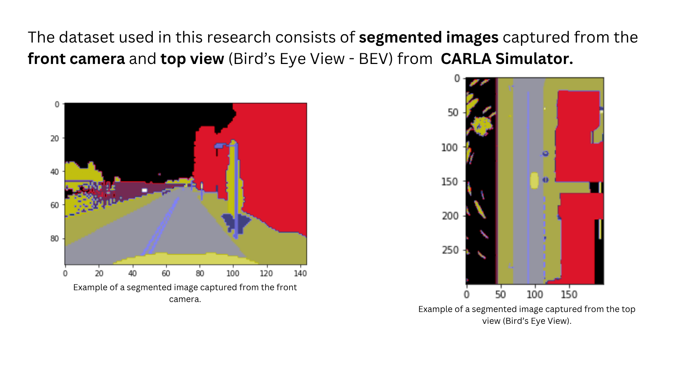
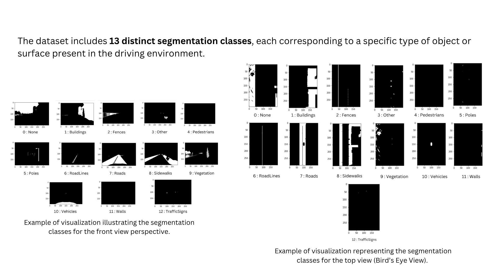
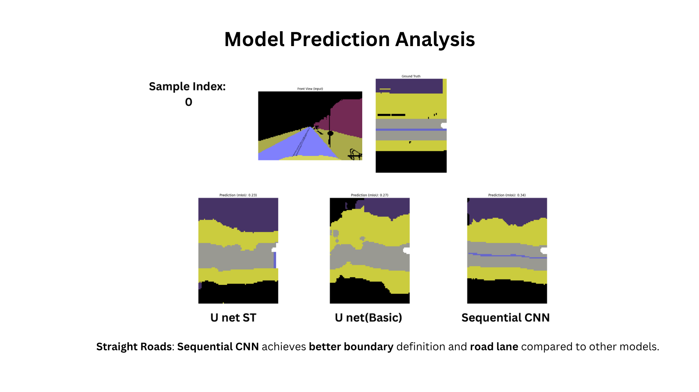
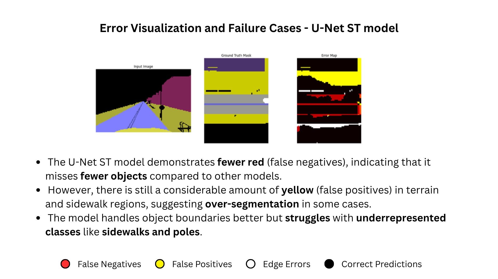

# Deep Learning for Autonomous Driving: Converting Segmented Front-View Images into Bird's-Eye Views

A comparative study of three deep-learning architectures for transforming front-view semantic segmentation maps into Bird's-Eye-View (BEV) representations, using the CARLA simulator. Master's thesis, SRH Berlin University of Applied Sciences (2025).

## Overview

Autonomous vehicles need a top-down (bird's-eye) understanding of their surroundings for lane detection, road-boundary estimation, and trajectory planning. Traditional geometric methods like Inverse Perspective Mapping (IPM) suffer from distortions, occlusions, and depth inconsistencies. This project investigates whether learning-based approaches — specifically a Spatial Transformer Network (STN) integrated into a U-Net — can produce better BEV transformations than baseline architectures.

I built, trained, and evaluated three models on a CARLA-generated dataset and compared them quantitatively (mIoU, loss/accuracy curves) and qualitatively (per-scenario predictions, error maps).

## Problem

Given a semantically segmented **front-view** image (13 classes: road, lane lines, vehicles, pedestrians, sidewalks, etc.), predict the corresponding **bird's-eye-view** segmentation map. This is a learned view transformation, not a fixed homography.

## Approach

**Dataset:** Paired front-view and BEV segmentation maps generated in the CARLA simulator, 13 segmentation classes, preprocessed to NumPy arrays.

**Models compared:**

| Model | Architecture | Key feature |
|---|---|---|
| U-Net ST | Encoder–decoder + Spatial Transformer Network | Learnable affine alignment before segmentation |
| U-Net (Basic) | Standard encoder–decoder with skip connections | Baseline |
| Sequential CNN | Stacked convolutional layers, no skip connections | Baseline |

**Training setup:** 50 epochs, batch size 32, custom loss combining **Dice Loss + SSIM** (segmentation accuracy + structural consistency), Adam/Nadam optimizers, Softmax output over 13 classes.

**Spatial Transformer Network:** implemented as a custom Keras layer (affine grid generator + bilinear sampler) to dynamically correct spatial misalignment between front-view features and the BEV target, without manual IPM preprocessing.

## Results

Reported as mean Intersection-over-Union (mIoU) on the validation set — the primary segmentation metric.

| Model | mIoU (%) |
|---|---|
| Sequential CNN | 28.67 |
| U-Net (Basic) | 22.33 |
| U-Net ST | 18.96 |

**Key findings:**

- The **Sequential CNN achieved the highest absolute mIoU**, with the cleanest boundaries on straight roads and intersections — but showed signs of overfitting on complex scenes.
- The **U-Net ST generalized best** (largest validation-side improvement, fewest false negatives in error analysis) and handled object boundaries better, but scored lowest on absolute mIoU and over-segmented terrain/sidewalk regions.
- **Object detection (vehicles, small objects) was weak across all three models** — the main shared failure mode.

These absolute mIoU values are well below current state-of-the-art BEV segmentation models (~70% mIoU, e.g. uNetXST, DeepLab variants), which were trained on different datasets and configurations. This work is a controlled comparison of architectures under constrained training, not a SOTA submission.

 -->

 -->

## What I took from it

- The STN improved spatial generalization but did not translate into higher absolute mIoU — a reminder that a single metric can hide the trade-off between generalization and raw overlap.
- Absolute segmentation quality was constrained by limited training (50 epochs), class imbalance (underrepresented classes like poles/sidewalks), and the difficulty of learning view transformation from segmentation maps alone.
- Clear next steps: more training epochs, stronger STN loss/optimizer tuning, class-balancing, and sensor fusion (e.g. LiDAR) to address the object-detection weakness.

## Tech stack

Python · TensorFlow / Keras · NumPy · CARLA Simulator · custom Dice + SSIM loss · Spatial Transformer Networks · semantic segmentation (U-Net)

## Acknowledgements

Master's thesis supervised at SRH Berlin University of Applied Sciences. References: Reiher et al. (2020), Sim2Real BEV; Peng et al. (2023), BEVSegFormer.
